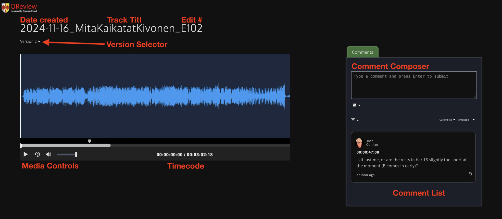
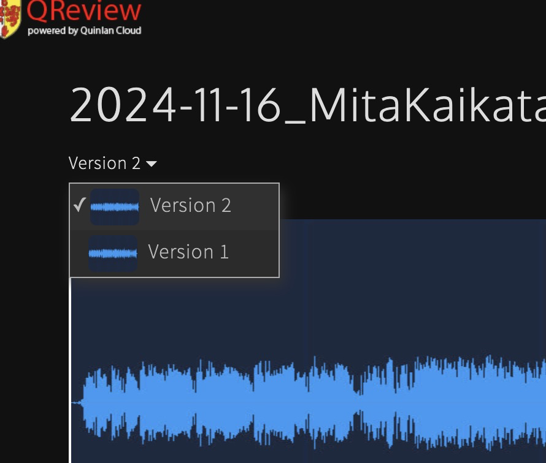
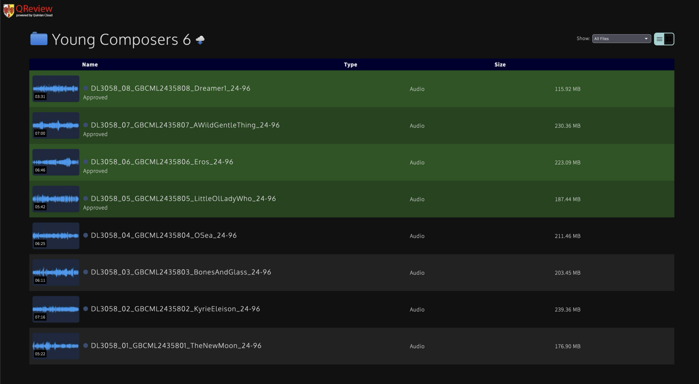
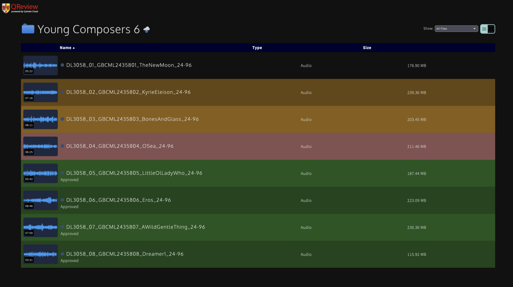

It’s crucial to me that all stakeholders get the chance to submit their feedback on recording projects, so I utilise a system called **QReview** to ensure that it’s easy to give, respond to and resolve all requests in a timely manner without needing to go through dozens of e-mail threads.

## Accessing QReview

When it is time for you to give feedback on a recording, you will receive a unique link through which you can access QReview. It will either be in an e-mail that comes directly from me, or an automated e-mail sent by the platform (from review-no-reply@quinlan.cloud). In either case, keep your link safe as it’s unique to you and won’t change throughout the project, though of course we can send it to you again if needed.

To access QReview, simply click on your link and you’ll be taken to one of two pages: a file tree or the player for a particular file.

**You must not share your unique link with anybody else.** All access to QReview is logged. If there is somebody else that you believe should have access to the file, please contact me and we can discuss it.


**QReview is designed to be accessed from a desktop computer/laptop**
Whilst it is possible to use QReview on a mobile phone or tablet, it has been optimised for desktop usage. As such, it is strongly recommended that you access QReview using a desktop computer/laptop on a reliable internet connection, not on a mobile connection.


## Using the player

In most cases, when you click your unique QReview link, you’ll be taken straight to the Player. You’ll see a screen that looks like this:

The first thing that you should do is set your name where indicated below the “Comments” header on the right hand side.

Once you’ve set your name, a text box will appear where you can enter your request/query.

Let’s go through each of the components shown on the page.

### Left pane - File info & playback

In the top left, you’ll see the filename which will be formatted as:
**BounceDate_TrackTitle_EditNumber**

* **BounceDate**: The date that the version was exported/bounced
* **TrackTitle**: The title of the piece
* **EditNumber**: Formatted `EXXX` (starting `E101`), this is a chronological number assigned to each version.

Beneath this, you’ll see text like “Version 2” with a dropdown arrow. This aligns with the EditNumber in the file name (EXXX); clicking on this will open a dropdown menu that allows you to select another version.

When you change edit versions using the Version Selector, your current playback position will be retained, which means that you can easily compare multiple versions. Your unique link will always link you to the latest version of the track.

Taking up the majority of the space in this pane is a graphical representation of the file (waveform) and media controls. These work like on any standard media player.

You may occasionally be given access to other functions (e.g. downloading files). Buttons to access these features will appear at the bottom of this pane.

### Right pane - Feedback

If you have been given access to post comments on files, you will see another pane on the right hand side. This functions like the comments system on social media sites and YouTube.

To add a new comment, firstly make sure that you have the right point selected in the media player – the current timecode is linked to the comment for easy review.

Then, enter your comment and hit enter to submit it.

If you need to edit or delete a comment that you’ve submitted, hover over it, click the dropdown arrow in the top right of the comment box and click the desired action. You will only be able to submit an action for a comment that has been made by you.

Should you wish to respond to a comment, click the **Reply** arrow in the bottom right of the comment, and the comment composer will be updated accordingly. When submitting a reply, it will appear below the comment being responded to, just like on social media platforms.

## Guidance on giving feedback

When writing comments, please make sure to include the following:

* **Where?** Though we can reference the timecode, it will save us a lot of time if you can also include a bar reference. If you’re referring to a specific beat, please specify the bar number and beat (e.g. bar 52, beat 4).
* **What’s the issue?** Please clearly describe the problem so we can quickly identify what you would like to be changed. If something doesn’t sound right but you can’t put your finger on it, that’s fine – just try to describe what you’re hearing as clearly as possible.
* **What is your desired action?** This could mean asking us to check for a new take, adjusting the mix, or something else.

If you have a general comment that is not associated with a specific time/bar, please leave these at the beginning or end of the track.

You do not need to:

* Mention any matters pertaining to noise (clicks, bumps, coughs, grumbles, hiss, etc.). This will all be addressed following the editing process, and does not require your input (unless specifically requested).
* Give any technical recommendations. Please describe the issue and what you are looking to achieve. If you have an idea of how to deal with that, please feel free to suggest it, but it is absolutely not a requirement. Leave that to us!
* Leave positive feedback in QReview, though feel free to send over any positive feedback via e-mail/message (that’s always nice!). The reason for this is that QReview is specifically used for to-do items and actions, and having non-actionable feedback, however nice, disrupts the process.

## Navigating the file tree

Rather than pointing directly to a file, your unique link may point towards a folder or a project, in which case you will need to navigate the file tree in order use the player.

This works pretty much like any standard file explorer. Select a file/folder to open it, and you will be taken to the player or deeper into the file tree respectively.

### Colour-coding

To make it quickly apparent where in the edit process a file/folder currently is, a number of colours are used.

* Black / no background colour = In the backlog / being edited
* Yellow = Edit complete, pending sign-off
* Pink = Approved / signed off, pending mastering
* Green = Mixed, mastered and delivered

---

Should you have any issues with using QReview or have any questions in general, please do not hesitate to get in touch. This system exists to make everyones’ lives easier, so if something isn’t working for you, let me know so I can fix it!
